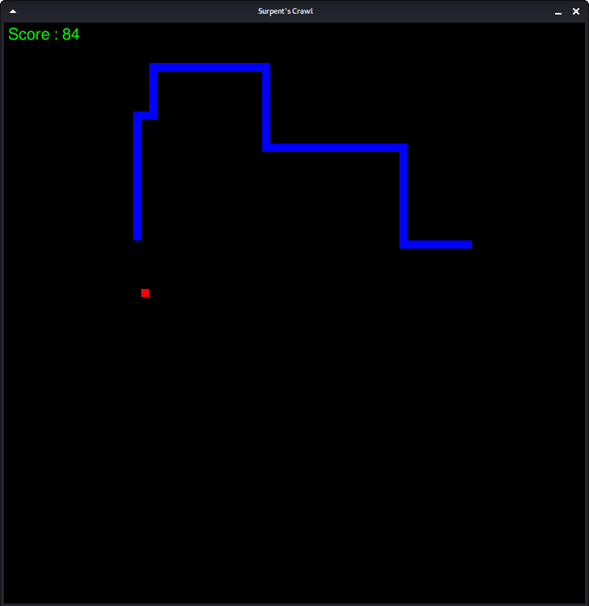

# Crawling-Surpent

Its a concept of a very popular and classic video game [**Snake**](https://en.wikipedia.org/wiki/Snake_(video_game_genre)) which I named as *Surpent's Crawl*. Snake is a video game where the player controls a snake i.e a dot/square on a plane, which grows when it's head touches another object named as food and it dies if it's head touches the border or itself.

# Programming

- In *Pyhton* using **Pygame**.

# Controls

- Arrow keys or 'WASD' as other games.

- Included a hidden cheat: player can find it himself.